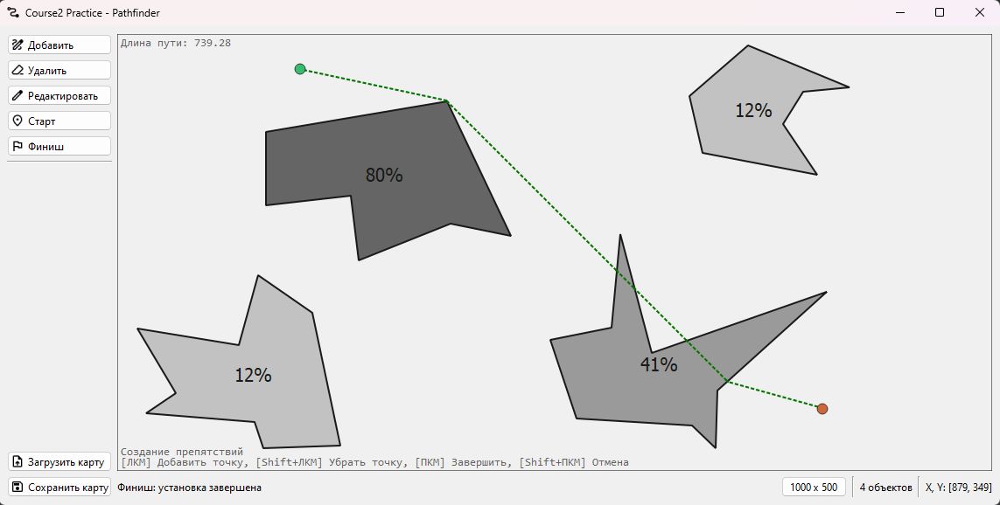
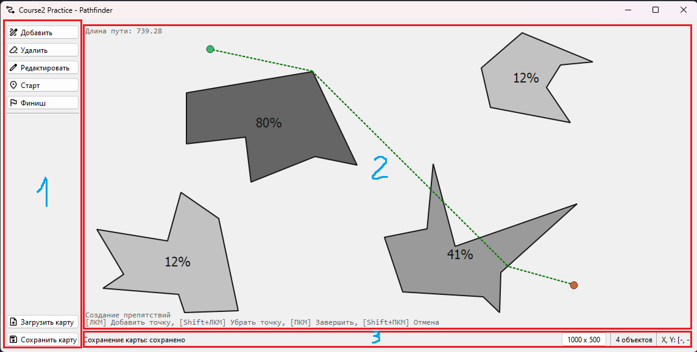
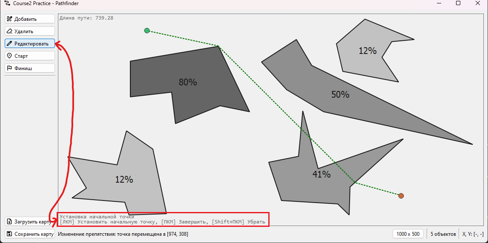
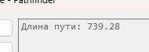
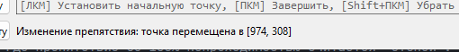
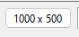
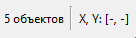
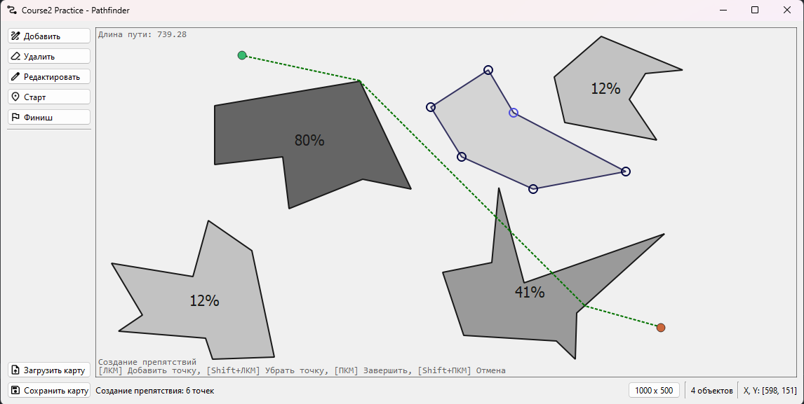
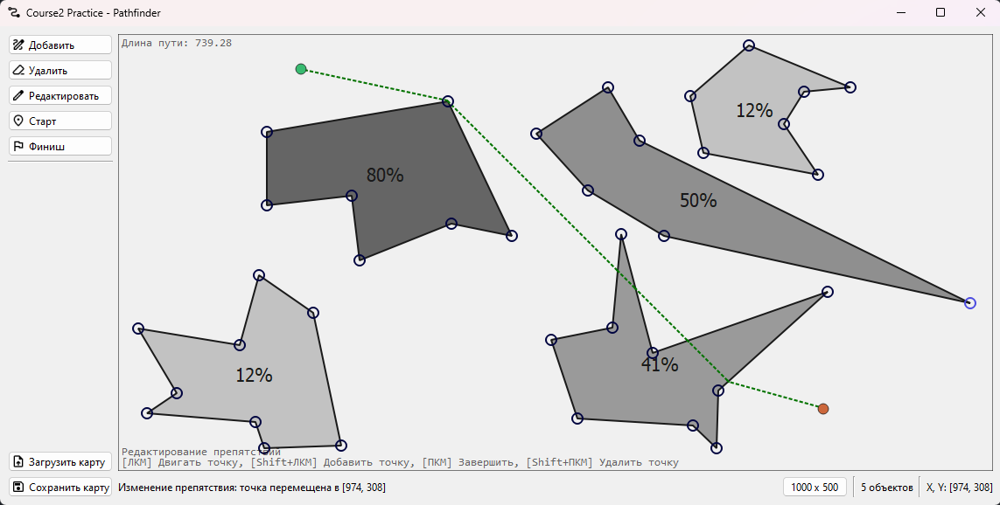

# Course 2 Practice

Поиск пути на двумерном поле с препятствиями.  

## Program Guide

При запуске программы можно увидеть кнопки управления *(1)*, главный экран *(2)* и панель статуса *(3)*.  
*Для удобства на каждый элемент интерфейса можно навести курсор и появятся подсказки с указанием того, что этот элемент делает.*

Кнопками контроля *(1)* управления можно взаимодействовать с объектами на карте.  
Также есть возможность горячих клавиш от `1` до `6` для удобства редактирования карты:

- `1` Проверка проходимости
- `2` Создание препятствия
- `3` Удаление препятствия
- `4` Изменение препятствия
- `5` Установка старта
- `6` Установка финиша

При работе с инструментами управления *(1)* на главном экране *(2)* в левом нижнем углу будет отображаться подсказка  
с текущим инструментом и его управлением,

А в левом верхнем углу будет отображаться длина найденного пути.  

В панели статуса *(3)* можно увидеть строку статуса (слева), где будут показываться результаты действий управления (например, "успешно" или "точка не найдена").  

Справа есть текст-кнопка, одновременно позволяющий поменять размеры карты и показывающий текущие размеры карты. Границы ширины и высоты ограниченны значениями от 100 до 2000.  

Также есть индикатор текущих координат, который отображает координаты курсора мыши на карте, и индикатор количества препятствий на карте.

### Добавление препятствия

Начать добавление препятствия на карту.  
*Левый клик мыши* на карте ставит/добавляет точку, формируя препятствие-многоугольник (полигон).  
Можно отменить установку последней точки *нажатием левой кнопки мыши с зажатым Shift*.  
*Правый клик мыши* завершает создание препятствия и предлагает пользователю указать непроходимость в открывшемся окне.  
*Правый клик мыши с зажатым Shift* отменяет создание препятствия и переходит в режим проверки проходимости.  

Препятствие не может пересекаться с другими и обязано иметь индекс непроходимости от 1% до 100%,  
где препятствие со 100% непроходимостью считается "стеной".

### Удаление препятствия

Войти в режим удаления препятствий с карты.  
*Левый клик мыши* по любому препятствию удаляет его.  
*Правый клик мыши* выходит из режима удаления препятствия и переходит в режим проверки проходимости.  

### Изменение препятствий

Начать редактирование существующих препятствий на карте.  
*Зажатие левого клика мыши* на карте по точке многоугольника берёт эту точку в захват, позволяя перемещать её по карте. **Перемещение точки не допускает создания пересечений на карте.**  
Можно добавить точку нажатием *левой кнопки мыши с зажатым Shift* **в многоугольнике**. Это действие разделит ближайшее ребро на две части с новой точкой.  
*Правый клик мыши* завершает редактирование и переходит в режим проверки проходимости.  
*Правый клик мыши с зажатым Shift* удаляет точку рядом с курсором. **Курсор должен лежать в многоугольнике той точки, которую вы собираетесь удалить.**  

### Установка старта & финиша

Установить точку старта/финиша на карте.  
*Левый клик мыши* устанавливает точку старта/финиша, либо заменяет её, если она уже существует.  
*Правый клик мыши с зажатым Shift* убирает точку старта/финиша.  
*Правый клик мыши* завершает редактирование и переходит в режим проверки проходимости.  

### Нахождение пути

После установки старта и финиша ищется кратчайший путь между этими двумя точками.  
Длина пути будет отображена в верхнем левом углу главного экрана *(2)*  

Путь не может быть найден, если:
- Точка старта/финиша лежит в препятствии со 100% непроходимостью
- Точка старта и точка финиша разделены препятствием со 100% непроходимостью
В таких случаях в верхнем левом углу появится надпись "путь не найден".

## Program Development

Программу можно скачать в релизах либо собрать самому  
Программа написана на `Qt 6.5.2 (msvc2019_64)`

### Debug

В целях разработки были добавлены сочетания клавиш, позволяющие отладить программу (кнопка отладки - `D`):
- `D + G` Enable/disable mesh grid
- `D + Shift + G` Enable/disable mesh grid outline
- `D + O` Enable/disable obstacle drawing
- `D + P` Enable/disable path drawing
- `D + Arrow Up` Raise cell size
- `D + Shift + Arrow Up` Raise cell size without mesh generation
- `D + Arrow Down` Lower cell size
- `D + Shift + Arrow Down` Lower cell size without mesh generation
- `D + M` Regenerate mesh

### Known Issues

- [ ] Непересечение области рисования должно проверяться после подтверждения, а не сразу

### Roadmap

Примерный план работы

- [x] Базовый интерфейс
- [x] Полигоны
- [x] Отрисовка
- [x] XML
- [x] Разделение поля на сетки
- [x] Отрисовка сетки
- [x] Алгоритм Дейкстры / `A*`
- [x] Поиск пути
- [x] XML + путь